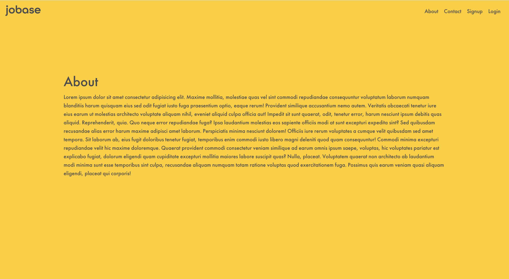
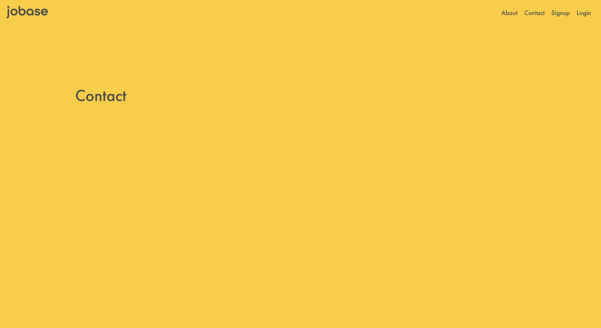

_Since graduating from Flatiron School in late October 2020, I have gone through different refactors of my weekly schedule, bought various courses on Udemy, and tried to research the best, free options to expanding on my technical education. So I felt that I should write this kind of a post to tell you what I learned about productivity and the new strategy that I'm doing now to help someone in similar shoes._

_I wanted to make this blog post interactive with opportunities for you, the reader, to answer personal questions for yourself to create your own productivity strategy._

# Recap

Last week's blog post was about adding structure to your day while trying to avoid the burnout and exhaustion of the post-coding bootcamp life (also helpful for grads of all kinds or anyone in the job search).

As you may recall, I asked you to ask yourself and answer these two questions:

❓**Question #1 — _Being honest with yourself — What is your work ethic? How long can you stay focused?_**

❓**Question #2 — _How do you learn?_**

Now, that you've answered the questions. I hope you were able to structure a well-balanced schedule that works for you and your work ethic.

Let's get started on the what I've learned about the job search since graduation.

<div style="width:100%;height:0;padding-bottom:75%;position:relative;"><iframe src="https://giphy.com/embed/WPaIWvAhxV1yo" width="100%" height="100%" style="position:absolute" frameBorder="0" class="giphy-embed" allowFullScreen></iframe></div>

# The Job Search

## Presenting yourself

<div style='position:relative; padding-bottom:calc(57.50% + 44px)'><iframe src='https://gfycat.com/ifr/ClosedReadyDeinonychus' frameborder='0' scrolling='no' width='100%' height='100%' style='position:absolute;top:0;left:0;' allowfullscreen></iframe></div>

There are a lot of ways to present yourself in the job market, but some of the successful ones that I've seen are being active on LinkedIn, blogging, building projects, attending events, and reaching out to professionals.

Questions to ask yourself:

❓**Question #1** — Is your LinkedIn up to date with previous work experience? Are the various sections (i.e. Certifications & Licenses, Publications, Education, Summary, etc.) filled out correctly?

(Make sure you have a profile picture too!)

❓**Question #2** — Are you a writer? It's okay if the answer is no, creating videos is a cool way to create interactions with people. Personally, I enjoy writing and challenging myself to explain things in simple terms (some years of experience in creating documentation at my former jobs).

Regarding building projects and networking via reaching out to people and attending events, these are obvious ways to get involved. Building projects help show that you understand and know the material you were taught in a bootcamp (or elsewhere) and can apply it to some from scratch. Reaching out and networking is pretty self-explanatory.

My job search strategy is culmination of being active on LinkedIn, blogging, building projects, attending events, and reaching out to professionals. Using the scheduled that alluded to in my previous blog post, I try to contact at least two people a day during the week and apply to two jobs a day.

## Applying (Quality Over Quantity)

Applying to two jobs a day is my personal goal as I'm trying to apply to companies that interest me, seem to be good opportunities for my career, and I have confidence in my ability to adapt and learn their tech stack (if I don't have those technologies under my belt).

One strategy that my career coach, Tom, and others have told me is to not apply to countless job posts. It's quality over quantity. My old strategy was to apply to as many jobs as I can and it was a mess. I was sending so many cover letters that I was barely changing them and while I'm not completely sure this happened, I wouldn't be surprised if I accidentally had the wrong position and/or company name in it.

A strategy that has helped me stay focused and organize my notes for interviews and tasks that I have to complete is the use of a kanban board. If you have used Trello or Asana before then you have experience with using a kanban board.

My recommendation is to create multiple versions of your resume, have .pdf and .docx versions (.docx works better with an ATS like Lever), and have certain parts of your cover letter created beforehand to help cut down on time.

# Something I learned on my own: Styled Components in React

Creating reusable styled components can help cut down on the additional writing you have to do to achieve a standard layout among certain pages.

The first step is to install the `styled-components` library for React.

```bash
# with npm
npm install --save styled-components

# with yarn
yarn add styled-components
```

The first part that you need to complete is to import the `styled` from the library (`styled-components`).

```jsx
import styled from "styled-components";
```

Next, we're going to need to create wrapping tag of our own creation. Here, I created a defined the variable `DefaultLayoutWrapper` and set it to equal to `styled.[HTML tag]`. In this case, I used `styled.section`. Then, we embed some CSS to format a page how we want it to look like.

```jsx
const DefaultLayoutWrapper = styled.section`
  margin-top: 10%;
  margin-bottom: 10%;
  margin-left: auto;
  margin-right: auto;
  width: 75%;
  color: #4c4c4c;
`;
```

Finally, we create our React functional component. We accepts a `props` parameter and setup the return statement. `props` is going to have a property of children which will be the HTML tags and content on the page. Inside the return statement, we'll wrap `props.children` with our styled wrapping tags so that anything wrapped within `<DefaultLayout>...</DefaultLayout>` will have the CSS style already added to it. At the bottom we export the component so that can be used in various pages.

```jsx
const DefaultLayout = props => {
  return <DefaultLayoutWrapper>{props.children}</DefaultLayoutWrapper>;
};

export default DefaultLayout;
```

Here are a couple of screenshots of the latest project that I'm working on, Jobase. (Jobase is a job seeker's best friend. An all-in-one job-seeking tool to find jobs, create a professional profile, and so much more.)

(The golden background color is something I wanted specifically. I'm still not sure if I wanted to keep that for all the pages. If so, I'll refactor and make a change in the `DefaultLayout` component.


<br>


Putting it altogether:

```jsx
import styled from "styled-components";

const DefaultLayoutWrapper = styled.section`
  margin-top: 10%;
  margin-bottom: 10%;
  margin-left: auto;
  margin-right: auto;
  width: 75%;
  color: #4c4c4c;
`;

const DefaultLayout = props => {
  return <DefaultLayoutWrapper>{props.children}</DefaultLayoutWrapper>;
};

export default DefaultLayout;
```

# Conclusion

Hope this blog post was helpful in your job search and if you're looking into creating your own styled components in React. I'm currently working on a side-side-project, creating my own React library if I have the time during the week.

Next week's blog post will be all about Redux. I'm still debating if this will be another series or I can attempt to keep it in one blog post.
