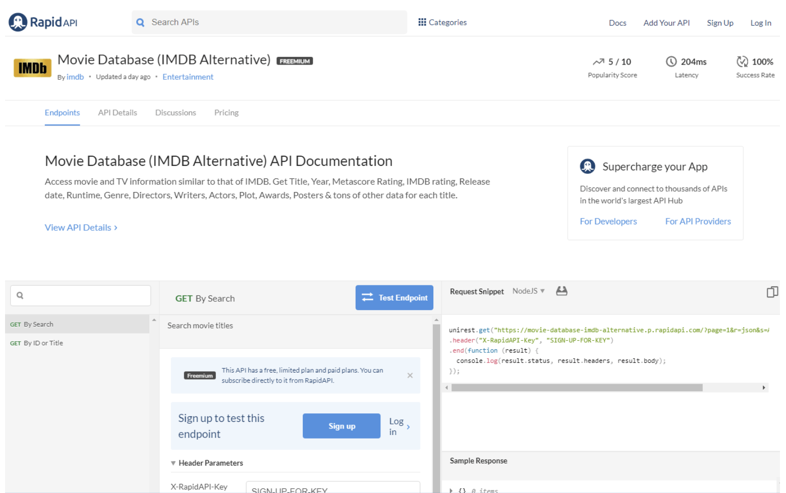
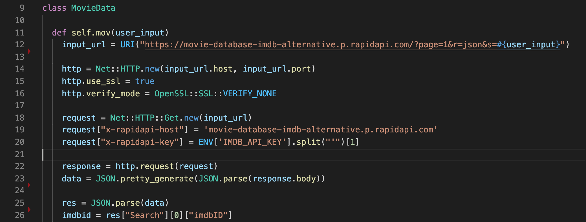

<h1>Demystifying APIs for Beginners</h1>

When you start learning to code via a coding bootcamp, like Flatiron School, you find yourself thrust into a chaotic environment. There’s a lot of collaboration and making new friends, self-learning, and self-discovery, and there is some panicking.

The worst thing you can do is psych yourself out and allow that to deter your motivation. More often than not, I’ve seen fellow classmates become bewildered by the amount of material thrown at us in such a small amount of time and then soar through the concept of “learning by doing.”

With enough practice and open-mindedness, you can be learning anything that you want. That being said, in Mod 1, via Flatiron’s Learn.co platform, one topic that does not have much instruction is integrating APIs, which is the reason why I wanted to write this blog post.

<h2>Crash Course: How Computers Talk</h2>

<h3>Client/Server</h3>
What does your phone and a credit card machine all have in common? They’re computers. All devices or machines that connect to the internet are computers and they communicate with each other.

When you’re playing music on your phone from Spotify, you’re connecting to a server, another computer, via an HTTP request. When you’re paying for something with a credit card, the transaction is sent from the credit card machine to a server maintained by your bank which will respond whether the transaction was approved or denied. Additionally, your computer is sending an HTTP request (hence, URLs start with `http://`) when you want to visit a website. The website's response to your request is in the form of HTML, CSS, and Javascript and other functionality that your browser translates it to look aesthetically pleasing frontend and experience.


<figurecaption>Medium.com (source code)
</figurecaption>


<figurecaption>Medium.com
</figurecaption>

This is how computers communicate with each other:


<figurecaption>From Learn.co, A Quick Tour of the Web</figurecaption>


<figurecaption>From Learn.co, A Quick Tour of the Web</figurecaption>

This brings us to the next section about APIs.

<h3>What is an API?</h3>
API stands for Application Programming Interface and allows you to access information and/or functionality from an application to use in a program within your own app or someone else’s app.
<br />
<br />
<strong>A popular analogy used:</strong>
<br />
<br />
<blockquote style="color:black"><em>You’re a customer <b>(client)</b> in a restaurant <b>(internet)</b>. You’re hungry and want to look at a menu <b>(an API)</b> with dishes <b>(data and/or functionality)</b> that you can order <b>(send a request)</b> to eat <b>(add to your program and app)</b>. Obviously being in a restaurant, you can only order using an existing list of words <b>(a predefined list of methods)</b> to request and receive a certain dish <b>(data/functionality)</b> that is within the menu <b>(API)</b>.</em></blockquote>

That wasn’t too bad though, right?

<strong>Use Cases and why you should care about APIs</strong>

Gaining access to APIs is more than just being able to search for your favorite movie on a website. You can create workflow automation that connects your application to other applications you may use. For instance, you can add functionality to your app that takes 10 integers as a phone number, uses the Twilio Verify API to add user verification in your app, and sends codes via voice, SMS, and email. The same can be done by sending SMS notifications via the Twilio SMS API.

APIs can be intimidating, but they shouldn’t be feared! They can really help your app come to life.

<h3>REST APIs</h3>

REST stands for <b>re</b>presentational <b>s</b>tate <b>t</b>ransfer. A REST API is the same thing as a RESTful API.

In case, you’re curious or you heard about SOAP APIs, REST APIs are preferred because their efficient and require less bandwidth and internet usage. REST APIs also uses XML, JSON, HTML, and plain text compared SOAP APIs requiring XML as it’s standard API type.

Remember, those predefined commands that I mentioned in our restaurant example?

Great! Well, these are the four main HTTP methods and here’s what they do using our restaurant analogy:

- `GET` — looking over at the kitchen to see if your server is coming with your food
- `PUT` — requesting to change your order
- `POST` — placing an order with your server
- `DELETE` — requesting to cancel your order

We’re going to focus on the `GET` method in this post.

<h2>Getting Started Quickly: Enter RapidAPI</h2>

RapidAPI is an API marketplace where you can test endpoints and connect to public REST APIs.

RapidAPI makes it very easy and approachable to start working with APIs:

<h3>Step 1: Create an Account</h3>

<h3>Step 2: Log in</h3>


<h3>Step 3: Search</h3>
Here, I’m going to search for IMDb’s API to connect and search for movies in my CLI app.


I chose to work with “Movie Database (IMDB Alternative)” because I was working on a film club app where users can signup/login to their account and create, join, and/or leave a film club, among other features.


Next, our screen will look something like this:



Then, you can choose your programming language via a dropdown next to the area that says “Request Snippet.” We’re going to use Ruby with the `Net::HTTP` class:

This is the code snippet that you can copy/paste right into your file.

You can add in a binding.pry to see what everything is doing.

And remember to <b>KEEP YOUR API KEY A SECRET</b>!


<h3>Step 4: Subscribe</h3>
Keep in mind that not every API on RapidAPI is free.


<h3>Step 5: Test the Endpoint(s)</h3>
Right inside of RapidAPI, you can test the endpoint and see what the output of your HTTP response will be:


`GET By Search`


`GET By ID or Title`


We’re going to be using both endpoints, `GET By Search` and `GET By ID or Title`. As you notice in the pictures, the `GET By Search` endpoint will return the title, release year, IMDb ID, type, and poster image link. However, it doesn’t have everything we need, but we can use the IMDb ID value in this hash with the `GET By ID or Title` endpoint. The latter method gets us all of the details that a movie fan would like.

<h3>Step 6: Implement</h3>
This is the fun part. No, really, I’m serious!
<br />
<br />


<h2>Implementation</h2>
We’ll focus on the code in parts.
<br />
<br />


<figurecaption>Lines 12–22 were generated for me through RapidAPI
</figurecaption>

My steps are as follows:

- I created a class called `MovieData`
- Within `MovieData`, I created a class method called `self.mov` and it takes a string as an argument. The method is called in another part of the app where a user can choose to search for a movie by title.


We need search by name because the `GET By Search` endpoint requires us to search with a movie title like `“Avengers Endgame”`.


- In return, we’ll receive a response like this:


- Keep in mind Lines 12–22 were generated for me by RapidAPI, so I placed in binding.pry to inspect what was happening and added in my own variables to break the code to understand what each line did.
- With binding.pry on Line 23, we have a big mess that isn’t pretty:


- The `res` variable is assigned to `JSON.parse(data)` parses that information to make it into presentable JSON.


- Then, we dive into this nested data structure with Line 26, `res[“Search”][0][“imdbID”]` and this will return our IMDb ID.

- We can do two things with this ID now:

1. We can interpolate the ID into a string that will create a link to the movie’s page on IMDb. Like this: `link_to_imdb = "Link to IMDB: <https://www.imdb.com/title/#{imdbid}/>"`
2. And most importantly, we can grab all of the relevant movie details, like actors, directors, writers, rating, plot summaries, etc. by searching with the `GET By ID or Title` endpoint, output the information what we want to give users, and add the movie to our database using ActiveRecord's `.create` method as seen on Line 63.

- Using our newly harvested IMDb ID, we can use the `GET By ID or Title` endpoint, simply start with copying/pasting the code snippet again, add our own variables to break it down, toss in a `binding.pry` wherever you need to, using our JSON methods to make the data look more aesthetically pleasing, and extract what we want.


<b>To demonstrate the movie search and giving a user results, please the gif below:</b>


In my app, when a user reaches the section to search for movies, you can simply type the movie title where you will receive details about the movie.

```
Movie Title: Jurassic Park
Release Year: 1993
Rated: PG-13
Runtime: 127 minutes
Genre: Action, Adventure, Sci-Fi, Thriller
Director: Steven Spielberg
Writer: Michael Crichton (novel), Michael Crichton (screenplay), David Koepp (screenplay)
Actors/Actresses: Sam Neill, Laura Dern, Jeff Goldblum, Richard Attenborough
Plot: A pragmatic paleontologist visiting an almost complete theme park is tasked with protecting a couple of kids after a power failure causes the park's cloned dinosaurs to run loose.
Language: English, Spanish
Country: USA
Awards: Won 3 Oscars. Another 39 wins & 27 nominations.
Poster Link: https://m.media-amazon.com/images/M/MV5BMjM2MDgxMDg0Nl5BMl5BanBnXkFtZTgwNTM2OTM5NDE@._V1_SX300.jpg
Imdb Rating: 8.1
Production:
Link to IMDB: https://www.imdb.com/title/tt0107290/
```

[Feel free to check out the GitHub Gist](https://gist.github.com/abeciana1/e3d13b442946ade14f9718446b3c1582.js)

<h2>Want to try this out?</h2>
If you really want to try this out quickly by creating your own CLI app and access API data, you can install my Ruby gem that sets up a skeleton for CLI apps. You can install it <a href="https://rubygems.org/gems/rcli_app" alt="rcli_app ruby gem">here</a>
 and use the GitHub repo for <a href="https://github.com/abeciana1/rcli_app" alt="rcli_app GitHub repo">guidance</a>.
