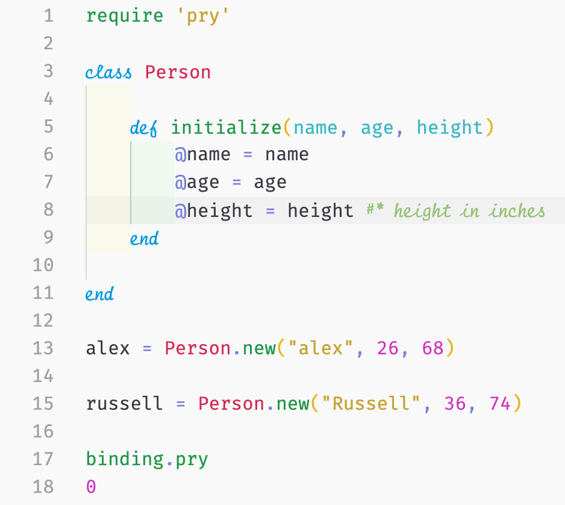
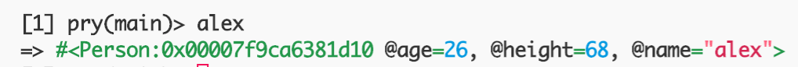
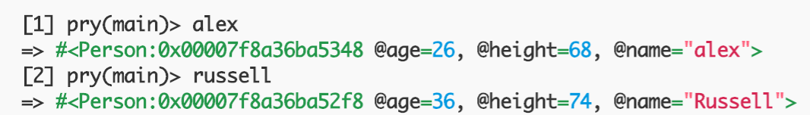

In this series, I will go over the principles and foundations of object-oriented programming and some principles on databases. I will be using Ruby because I feel comfortable in the language; however, these concepts with some minor changes in syntax can be translated to other object-oriented programming languages, like Java, Node.js, etc.

# What is Object-Oriented Programming?

Object-orient programming (or OOP, for short) refers to programming languages that use objects. If you have some experience in JavaScript or Ruby, you know them by two names Objects and Hashes, respectively. Regardless of the name, they are associative arrays that create an unordered list of unique attributes with values (key-value pairs).

This is where classes come in. Classes are like a blueprint for a something in the real-world. Similar to how an object is resembles an individual person, place, or thing in the real-world. It has attributes, characteristics, and behaviors. Let's add more detail with something relatable, consider the following simple examples.

**Example 1**

A person has a name, an age, and a height.

```ruby
class Person

	def initialize(name, age, height)
		@name = name
		@age = age
		@height = height # height in inches as an integer
	end

end
```

Similar to other languages we use a method/function in our class to establish the attributes that our class should be initialized with. For instance, in JavaScript, the constructor function does the same duty as Ruby's initialize method. In this case, we said that person has a name, an age, and a height.

In Ruby, creating a new instance (or object) of the `Person` class would look like this:

```ruby
alex = Person.new("alex", 26, 68)
```



# Instances of a Class

As mentioned above, we created an instance of the `Person` class and set the variable `alex` equal to it (Line 13).

In my console, `alex` evaluated to this:



Here, we have the instance (or object) that we created. We can see the obvious parts of the data, like the age, height, and name attributes. But the discussion point here is `#<Person:0x00007f9ca6381d10`. This indicates that this object is an instance of the `Person` class and it can be found here: `0x00007f9ca6381d10`. This is a memory reference to the unique storage location in memory of this object.

What do you think would happen if we created another instance and set another variable equal to it. Let's see:



\*\*You might notice that the `alex` instance has a new a difference memory reference. This is because we're not hooked up to a database. Nothing is really being saved here. But we'll get to that later in this series.

In this last screenshot, we can see memory reference for `alex` (`Person:0x00007f8a36ba5348`) and `russell` (`Person:0x00007f8a36ba52f8`). Notice that they're different. Although they are from the same class, or this in case, they're both human, they are still different. Both `alex` and `russell` have names, ages, and heights, but they're still two different people, just like the real-world. As mentioned in the introduction, this concept and the others that I will go over in this series can be translated into other programming languages.
