_In this series, I will go over the principles and foundations of object-oriented programming and some principles on databases. I will be using Ruby because I feel comfortable in the language; however, these concepts with some minor changes in syntax can be translated to other object-oriented programming languages, like Java, Node.js, etc._

Hello again, if you read my first blog post in this series. And welcome, if this your first time.

In my last post, if you haven't read it and/or need to brush up on the basic concept of object-oriented programming and classes, you can find the article here.

# What is a Class?

In my last article, I used this definition:

Classes are like a blueprint for a something in the real-world. Similar to how an object is resembles an individual person, place, or thing in the real-world. It has attributes, characteristics, and behaviors.

But, what are these attributes, characteristics, and behaviors that is based on what happens in the real-world and how we can emulate it in code?

Let's take a look at our `Person` class:

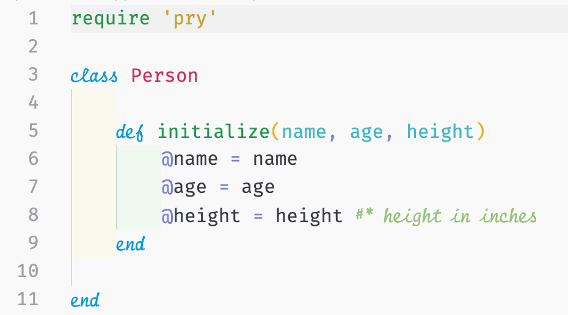

We determined that a person (or an _instance_ of `Person`) has a name, an age, and a height. In that case, a person should know their name, age, and height. And we can use methods in our class to invoke a certain behavior, like saying their name, age, or height.

First, we need to create a few methods to that our instance can call on to access the information we gave it.

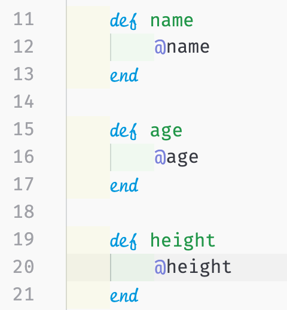

After creating the methods that access our instance variables, we can create these behavior methods. Let's give it a try:

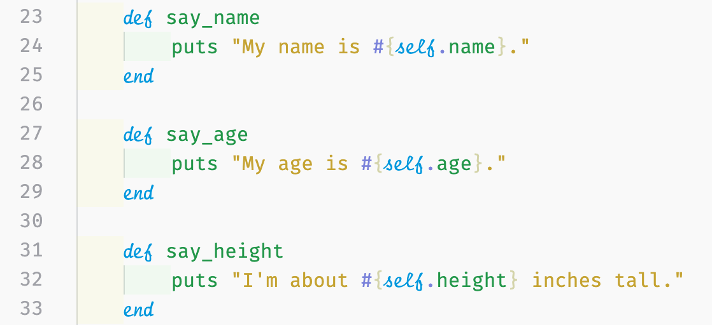

Using the `say_name`, `say_age`, and `say_height` methods, we now give instances of the `Person` class the ability to say (or print out) their name, age, and height. Using one of our examples from the last article:

```ruby
alex = Person.new("alex", 26, 68)
```

The instance assigned to the variable `alex` can now call on these instance methods. (We'll go over the differences between instance and class methods.)Here's what it would look like in the terminal:

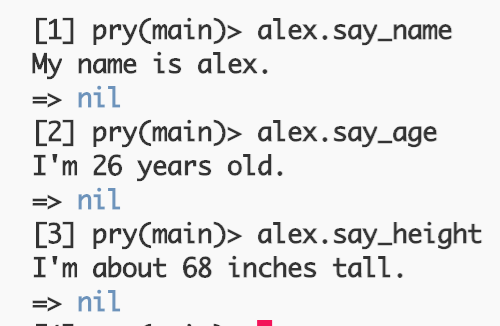

(You ignore the `nil`, it's the return value of using `puts`. It's similar to `console.log()` in JavaScript that returns in undefined.)

As you can see our instance can now speak and say the attributes that know about themselves.

Now that our instance knows things about itself, let's do some abstraction/we're getting a little philosophical.

# Class Methods vs. Instance Methods

## To Thine Own Self Be True

You may have noticed above that we used the keyword `self` in our behavioral methods. When used within a method, it refers to the instance of the class that calls on the instance method.

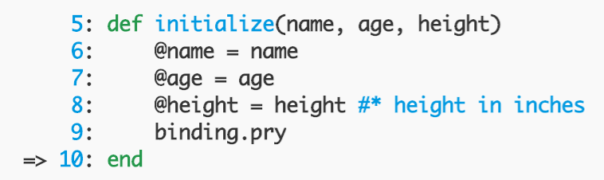

For example, I placed a `binding.pry` within the initialize method. When calling on the variable `alex`, we can see that `self` refers to the instance of the `Person` class:

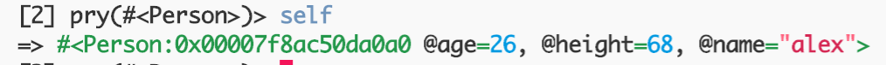

Let's see what happens when we add a `binding.pry` outside of a method but still within the class.

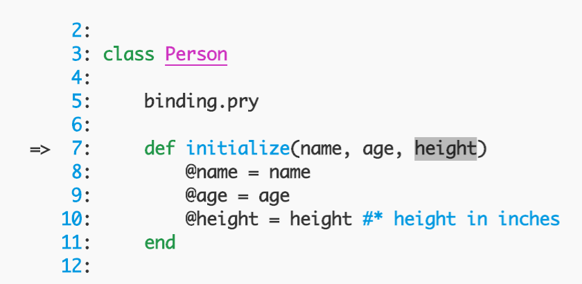

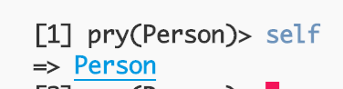

Just as expected, `self` in this case refers to the `Person` class.

## The Differences of Methods

An easy way to remember the difference between both types of methods is the use of `self` in the method name.

As we saw, the `say_name` method is an instance method and can only be called on by an instance of a class because it access the attributes of that instance.

## A Brief Note on Class and Instance Variables

We have already used instance variables in our construction of instances and accessing their information/attributes (e.g. `@name`).

A class variable is contains an extra `@` symbol and is defined outside of a method (i.e. `@@all`). A class variable name can also be defined using capital letters (i.e. `ALL`).

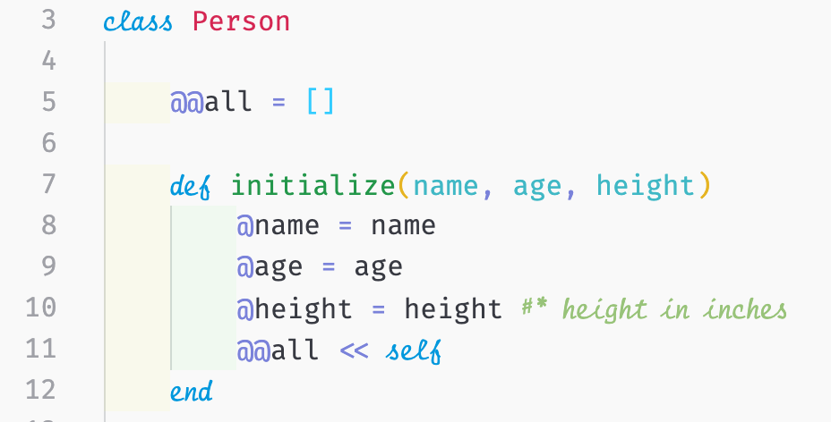

In the example above, we have defined the class variable `@@all` and assigned to equal an empty array. We also instruct our initialize method to "shovel" or add each instance of the `Person` class to the array.

Here's the philosophical part: As a person we should know certain things about ourselves. Although not all people know each other, we are still connected as a species. Therefore, in a way, our species should technically know every person derived from it. In this case, we can create a method that can only be accessed by the class (i.e. a class method).

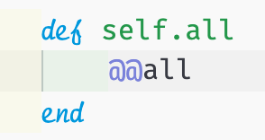

Using the keyword `self` in a method name allows the class to call on it. When we call `Person.all`, the method should return an array of the instances created.

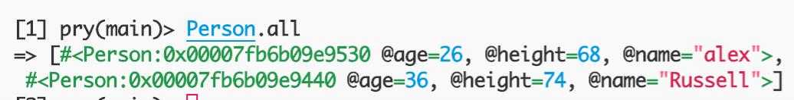

And here we go, both instances of the `Person` class that we created are now returns. Through other class methods, we can loop or iterate through this for other purposes as well.

# Conclusion

Thanks for reading! I hope this article helped you and I hope that you keep reading articles in this series.
