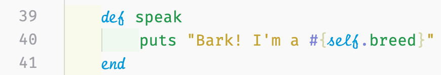

_In this series, I will go over the principles and foundations of object-oriented programming and some principles on databases. I will be using Ruby because I feel comfortable in the language; however, these concepts with some minor changes in syntax can be translated to other object-oriented programming languages, like Java, Node.js, etc._

Hey!

I wanted to add some other tips on classes to show how object-oriented programming tries to emulate the real-world.

In my last post, we talked about what a class is, the initialize method, scope and knowing what the keyword _self_ refers to, class and instance methods, class and instance variables, and most importantly, the use of methods to enact behavior and/or attributes.

In this article, I'll go over the concept of inheritance with classes.

# What is Inheritance?

Growing and going to school, we learned about inheritance in many ways. As a child, you grow up and you may hear how you look just like one of your relatives. Perhaps, you learned about inheritance by receiving hand-me-downs from an older sibling or a gift that once belonged to a relative.

In school, I distinctly remember learning about Gregor Mendel and his theories of biological inheritance during the late 1860s. I'm sure sure we all remember about Punnett squares and how recessive or dominant traits are passed down from parents to offspring.


A similar thing happens in classes in object-oriented programming. Sometimes you may find that you need to inherit methods from a class. Let's start with an example:


We have a `LandAnimal` class that initialized with simple attributes, height and weight. I also included a method called `speak` because all animals have some form of communication with each other.

As we've done in the past, I'm going to create a new instance of the `LandAnimal` class, pass in values for the initialize method, and then I will invoke a behavior method (in this case, the method `speak`).


When I run my terminal command: `ruby app/models/animal.rb`, the output is:


I realize this isn't exciting and it's not new. So let's create a new class called `Dog` and inherit from the animal class.


Using the `<` symbol in the class name as `class ChildClass < ParentClass` you can inherit any methods from the parent class (`LandAnimal`).

I'm going to create a new instance of the Dog class, pass in the values for the initialize method, and then invoke the `speak` method even though we didn't create one in the `Dog` class.


When I run my terminal command again: `ruby app/models/animal.rb`, the output is:


As you can see, the `Dog` class didn't have a `speak` method written but it inherited the one from the parent class, `LandAnimal`. However, we can overwrite that method by creating our own `speak` method in the `Dog` class.



Now let's run the terminal command a third time. Our output is:


BAM! We overwrote the `speak` method from `LandAnimal` with our own.

We can go even further and create separate classes for different breeds because animals have different attributes and behavior across various species. In each breed, we can different `speak` methods as well as breed-specific methods.

# Conclusion

I realize this post is quite short but I'll have another one next week. I may do another short one based on reader and writer methods.

If you're a beginner Rubyist or just beginning your coding journey and getting into OOP, please copy and paste this code in your own editor and play around with it.

```ruby
class LandAnimal

    @@all = []

    def initialize(height, weight)
        @height = height #* inches
        @weight = weight #* pounds
        @@all << self
    end

    def speak
        puts "Hey I'm an animal"
    end

    def height
        @height
    end

    def weight
        @weight
    end

end

# animal1 = LandAnimal.new(24, 30)
# animal1.speak

class Dog < LandAnimal

    @@all = []

    def initialize(name, age, breed)
        @name = name
        @age = age
        @breed = breed
        @@all << self
    end

    def speak
        puts "Bark! I'm a #{self.breed}"
    end

    def name
        @name
    end

    def age
        @age
    end

    def breed
        @breed
    end

end

dog1 = Dog.new("Rover", 3, "Poodle")
dog1.speak
```
