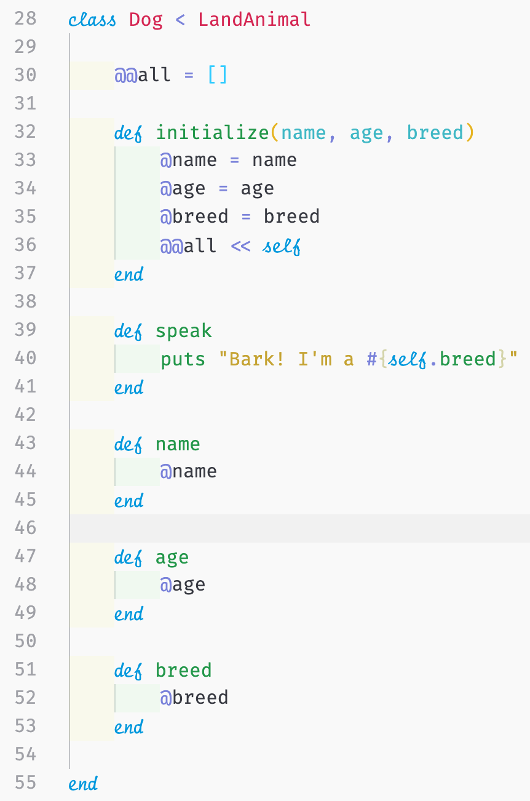

_In this series, I will go over the principles and foundations of object-oriented programming and some principles on databases. I will be using Ruby because I feel comfortable in the language; however, these concepts with some minor changes in syntax can be translated to other object-oriented programming languages, like Java, Node.js, etc._

Welcome back!

This week, I wanted to talk about the `attr` method that is used in classes. Next week, I plan on writing about the associations which is something you should know when working with relational databases, like PostgreSQL.

First, let's do a recap of what we covered in the last couple of weeks and look at the code we wrote last week.



As you may recall, we had a `Dog` class that initialized with the attributes of `name`, `age`, and `breed`. We also had a similar initialize method with the attributes of `name`, `age`, and `height`. You may have noticed that to to call on those attributes we needed to create **instance** methods which returns the value of that attribute called inside.

Let's examine the `Dog` class' `name` method:

```ruby
class Dog
...

	def name
		@name
	end

...
end

dog1 = Dog.new("Rover", 3, "Poodle")

#=> #<Dog:0x00007fb8dba87000 @age=3, @breed="Poodle", @name="Rover">

dog1.name

#=> "Rover"
```

Without the `name` method to return the `name` attribute this is the error we would receive:

```ruby
NoMethodError: undefined method `name' for #<Dog:0x00007fb0d1cc3830 @name="Rover", @age=3, @breed="Poodle">
from (pry):1:in `<main>'
```

### Why

This is part of the funny behavior you'll notice as you get more involved with ActiveRecord (covered a little later in this series).

When we call `[dog1.name](http://dog1.name)` we're not calling on the `name` attribute, but instead the `name` method (or what will be referred to as the `name` "reader" method).

## A Quick Note on Reader and Writer Methods

### Reader Methods (Getter Methods)

It says it in the name, reader methods (also known as **getter methods**) are methods that allow you to access information in a read-only format. For instance, making a mix on a CD-R, you can only access the music on there but you can't rewrite the information. (Hope that doesn't date me too much, I'm an "old" 26 year old - I hope I'm still hip.) So when we try to rewrite or overwrite the information on a reader method, like `name`, we receive this error:

```ruby
NoMethodError: undefined method `name=' for #<Dog:0x00007fab5443c798 @name="Rover", @age=3, @breed="Poodle">
Did you mean?  name
from (pry):1:in `<main>'
```

The keyword in this error message is the `'name='` part. It's giving us the answer. It's saying it doesn't recognize the `'name='` method, so we should write one.

### Writer Methods (Setter Methods)

Similar to above, writer methods (also known as **setter methods**) are methods that allow you to rewrite or overwrite information. For instance, adding and/or replacing phone numbers on speed dial on your landline. (I'm still young and hip.) So when you rewrite the information on an attribute you simple set the attribute equal to the new value.

Let's try it out:

```ruby
class Dog
...

	def name
		@name
	end

	def name= (new_name)
		@name = new_name
  end

...
end

dog1 = Dog.new("Rover", 3, "Poodle")

#=> #<Dog:0x00007fd44d5bb1b0 @age=3, @breed="Poodle", @name="Rover">

dog1.name

#=> "Rover"

dog1.name = "Bean"

#=> "Bean"

dog1

#=> #<Dog:0x00007fd44d5bb1b0 @age=3, @breed="Poodle", @name="Bean">
```

Here, we have successfully changed our dog's name from "Rover" to "Bean."

# The `attr` method

When you're first starting out, this may perhaps seem like a lot to remember and typing, creating reader and writer methods. However, your life is about become a little easier.... I would like to introduce the `attr` method to you.

There are three `attr` methods to remember: `attr_accessor`, `attr_reader`, and `attr_writer`. They'll replace the getter (reader) and setter (writer) instance methods.

## `attr_accessor`

The `attr_accesor` method allows you to read and write. A general rule of thumb that I stick to is when in doubt, you this one. Unless it a method that should be read only.

## `attr_reader`

The `attr_reader` method creates the getter instance method.

## `attr_writer`

The `attr_writer` method creates the setter instance method.

## Refactoring

## Before

```ruby
class Dog < LandAnimal

    @@all = []

    def initialize(name, age, breed)
        @name = name
        @age = age
        @breed = breed
        @@all << self
    end

    def speak
        puts "Bark! I'm a #{self.breed}"
    end

    def name
        @name
    end

    def name= (new_name)
        @name = new_name
    end

    def age
        @age
    end

    def breed
        @breed
    end

end
```

## After

Let's refactor our `Dog` class and use our `attr` methods:

```ruby
class Dog < LandAnimal

    attr_accessor :name
    attr_reader :breed, :age

    @@all = []

    def initialize(name, age, breed)
        @name = name
        @age = age
        @breed = breed
        @@all << self
    end

    def speak
        puts "Bark! I'm a #{self.breed}"
    end

end
```

That's right! It's that easy and there's no gem to download. It's simply built into Ruby already. To show off a writer method, we could have added a `new_toy` attribute and it could change every time the dog receives a new toy.

# Conclusion

I hope this blog post helped explain setter (writer) and getter (reader) methods. No matter what language you're currently learning, these concepts can still be found. They may just have different syntax.

As mentioned above, next week I'll go over model associations.
