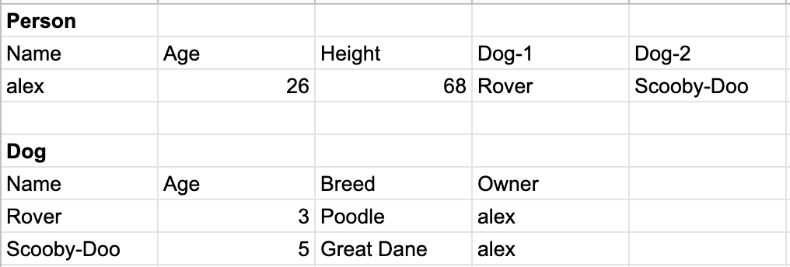

*In this series, I will go over the principles and foundations of object-oriented programming and some principles on databases. I will be using Ruby because I feel comfortable in the language; however, these concepts with some minor changes in syntax can be translated to other object-oriented programming languages, like Java, Node.js, etc.*

Woo!

If you're creating a CLI application and/or practicing these concepts, this is an article that I think you should pay attention to. We're going to continue our talk about relationships and associations between models, specifically on how we can maintain a clean and manageable database with these relationships.

But, first let's do recap.

# Recap

In my last article, we still had our `Person` and `Dog` classes. 

`Person.rb`

```ruby
class Person

    @@all = []

    attr_accessor :name, :age, :height

    def initialize(name, age, height)
        @name = name
        @age = age
        @height = height #* height in inches
        @@all << self
    end

    def self.all
        @@all
    end

    def say_name
        puts "My name is #{self.name}."
    end

    def say_age
        puts "I'm #{self.age} years old."
    end

    def say_height
        puts "I'm about #{self.height} inches tall."
    end

    def adopt_a_dog(dog_instance)
        dog_instance.owner = self
    end

    def buy_a_dog(name, age, breed)
        # (name, age, breed, owner) #! the values for the Dog class initialize method
        Dog.new(name, age, breed, self)
    end

end
```

`Dog.rb`

```ruby
class Dog

    attr_accessor :name, :owner
    attr_reader :breed, :age

    @@all = []

    def initialize(name, age, breed, owner)
        @name = name
        @age = age
        @breed = breed
        @owner = owner
        @@all << self
    end

    def speak
        puts "Bark! I'm a #{self.breed}"
    end

end
```

In our `console.rb` file (where we can interact with both classes and run our instance methods), we had:

```ruby
require 'pry'

require_relative "./app/models/dog.rb"
require_relative "./app/models/person.rb"

alex = Person.new("alex", 26, 68)
dog1 = Dog.new("Rover", 3, "Poodle", "No Owner (Yet)")

alex.adopt_a_dog(dog1)

dog1

binding.pry
0
```

When running the line with `alex.adopt_a_dog(dog1)`, the `dog1`'s owner attribute changes to `alex` (the object, not just the name). Recall, this is what was called a **has-many** relationship.


A person can have many dogs and dog belongs to a person. The dog holds the reference to the instance of the owner because we want to maintain a **Single Source of Truth**. But there is another reason why we can't hold a reference of the dog in the `Person` class.

# Databases

The relationships are used in relational databases, and an simplified of a database is a data table.


Holding the reference of the dog works for the `Person` class, if we only have one dog to worry about.


Now, things change when we have a second instance of the `Dog` class. Notice the difference?

We needed to change our `Person` class slightly. Now our instances have an extra column to account for a second dog. In this case, we're going to have to change our database and an extra column each time we want our `Person` instance to have another dog.



What if we have another `Person` instance, but they don't have a dog. We're going to have to put `nil` values in those columns. 


This other route of having a reference to all the dogs we may own in the same `Person` database is going to be messy and hard to maintain. We want our lives to be easier.

# Association Methods

Since we can't add multiple dogs as separate columns to our `Person` class, we can alternatively create association methods to get data that want from another class.

We actually did this already. Recall our `Dog` class and the attribute of owner. We used the `attr_accessor` method so that we can **get** and **set** owners for a specific instance of `Dog`. Therefore, when we call `dog1.owner` we return the object `alex` because a dog knows it's owner. Similarly, a person should their dog(s) as well. Let's first take a look at our `console.rb` file. 

`console.rb`

```ruby
require 'pry'

require_relative "./app/models/dog.rb"
require_relative "./app/models/person.rb"

alex = Person.new("alex", 26, 68)
dog1 = Dog.new("Rover", 3, "Poodle", "No Owner (Yet)")
dog2 = Dog.new("Scooby-Doo", 5, "Great Dane", "No Owner (Yet)")

alex.adopt_a_dog(dog1)
alex.adopt_a_dog(dog2)

dog1

alex.dogs

binding.pry
0
```

**Note:** I added a `0` under the `binding.pry` because `binding.pry` won't work when it's the last line. I added a second dog, `dog2` and `alex` will be it's owner as well.

I added a new method to my `Person` class:

```ruby
class Person
...

		def dogs
        Dog.all.select do |dog|
            dog.owner == self
        end
    end

...
end
```

In our `dogs` method, we're called on the `Dog` class' `self.all` class method to return an array of `Dog` instances. Then, we're selecting all the dogs that are owned by `self` (in this case, it `self` refers to `alex` because we're calling on this instance method, like so `alex.dogs`).


As you can see when we call on the method we get both instances of `Dog`.

# Conclusion

We're one step closer to where we need to be to start thinking about creating apps and how data is managed in a relational database.