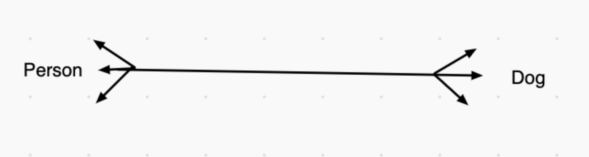
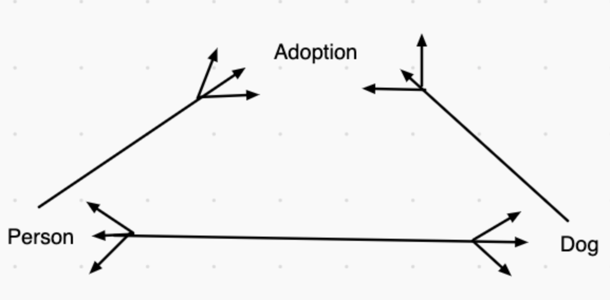

*In this series, I will go over the principles and foundations of object-oriented programming and some principles on databases. I will be using Ruby because I feel comfortable in the language; however, these concepts with some minor changes in syntax can be translated to other object-oriented programming languages, like Java, Node.js, etc.*

Welcome back!

This week, I want to build on the concepts of relationships and associations of models. We have been talk about our `Dog` and `Person` classes the entire time and labelled the relationship as a **has-many/belongs-to** relationship. A person can have many dogs and a dog only has one owner. Well, what if you have a sibling and you both take care of the dog, who is the owner? Wouldn't it be both of you?

Enter: **Many-to-Many Relationships**

# Recap

Last week, we went over more how class model relationships and association will be useful in databases and how we're going to need to maintain those relationship so that our database has clean data. As we mentioned, part of that task is to make sure we have a **Single Source of Truth** where one model will hold the reference of another. In our case, our `Dog` model can initialize a new instance with an owner attribute. That owner attribute is an instance of the `Person` class. Again, we reference the entire `Person` instance as the owner, instead of only the name so that we can know who is the actual owner.

Think about it with a real-world concept. Two people are named Jack and one them owns a dog. The dog knows which person is their owner because of the way they look, talk, walk, smell, and other mannerisms and behavior. Those attributes are make a person separate from another. We don't discern people just based on their name (or at least we shouldn't), so why should I our relational database that is supposed to model the real-world do that?

# What is Many-to-Many Relationship?

A **many-to-many** relationship is very similar to our previously mentioned **has-many** relationship. 



Here, as we noted, we still want a person to have the ability to have many dogs, as many as they want. We also want a dog to have more than one owner where these owners are a married couple or a couple of friend, whatever. Do see the problem with our illustration yet?

...

...

That's right, you're smart! This is the same problem that faced last week. We need a ....? Yup, a **Single Source of Truth**. We need one model to hold the reference of the other model, but how? We can't have the `Person` class hold reference to all of the dogs, and we can have the `Dog` class hold reference to all of the owners. This where we introduce the use of a **joiner model**. A joiner model is where we can store the references of both the `Dog` and `Person` classes as well as relationship methods to run. Another way to think of a joiner model is to think of it as two **has-many/belongs-to** relationships.



# Refactoring Code

In the updated illustration, I created a joiner called `Adoption`. In our code, there are two changes to make before working on our methods:

`dog.rb`

```ruby
class Dog

    attr_accessor :name
    attr_reader :breed, :age

    @@all = []

    def initialize(name, age, breed) #! (name, age, breed, owner) - old
        @name = name
        @age = age
        @breed = breed
        # @owner = owner
        @@all << self
    end

    def self.all
        @@all
    end

    def speak
        puts "Bark! I'm a #{self.breed}"
    end

end
```

I changed the arguments that the `Dog` class needed for initialization and remove the owner attribute from the `attr_accessor` method.

`adoption.rb`

```ruby
class Adoption

    attr_accessor :dog, :owner
    
    def initialize(dog, owner)
        @dog = dog
        @owner = owner
    end

end
```

Here, I created the `Adoption` class to hold the reference of both the `Dog` and `Person` classes.

Our `Person` class is going to have more changes because we're not going to be directly interacting with the `Dog` class anymore. Everything will be going through the `Adoption` class.

Let's check out our `Person` class now:

```ruby
class Person

    @@all = []

    attr_accessor :name, :age, :height

    def initialize(name, age, height)
        @name = name
        @age = age
        @height = height #* height in inches
        @@all << self
    end

    def self.all
        @@all
    end
    
    def say_name
        puts "My name is #{self.name}."
    end
    
    def say_age
        puts "I'm #{self.age} years old."
    end
    
    def say_height
        puts "I'm about #{self.height} inches tall."
    end

    def dogs
        my_adoptions = Adoption.all.select do |adoption|
            adoption.owner == self
        end #! returns a new array of adoptions where I'm the owner

        my_adoptions.map do |adoption|
            adoption.dog
        end #! returns new array of just my dogs
    end

    def say_dog_names
        self.dogs.map do |dog|
            puts dog.name
        end
    end

    def adopt_a_dog(dog_instance)
        Adoption.new(dog_instance, self)
    end
    
    def buy_a_dog(name, age, breed)
        dog = Dog.new(name, age, breed)
        Adoption.new(dog, self)
    end

end
```

I gave our `dogs` instance method a rewrite. We're now calling on our `Adoption` class and it's `all` class method and selecting only the adoptions where our `Person` instance (in my case, me) as the owner. I assigned that to a variable called `my_adoptions`. We're halfway done because remember the objective of this method is to return an array of just our dogs, not the adoptions. As you can see, we do another iteration, this time on the returned value of the previous iteration. Now, I only want to return the actual `Dog` instances from the adoptions.

Similar to last week's versions of the `adopt_a_dog` and `buy_a_dog`, nothing much has changed, we're just incorporating the `Adoption` class and initialize method arguments in these methods.

I added an additional method in the `Dog` class called `owners`. 

```ruby
class Dog
...
		def owners
        my_adoption = Adoption.all.select do |adoption|
            adoption.dog == self
        end

        my_adoption.map do |adoption|
            adoption.owner
        end
    end
...
end
```

This `owners` method works the same as our `Person` class method `dogs`. This method will return an array of `Person` instance(s) based on this `Dog` instance's adoptions.

# Conclusion

I hope this article was helpful. This is another piece of the puzzle to help get you on your way to creating your own app and thinking about the backend structure.
