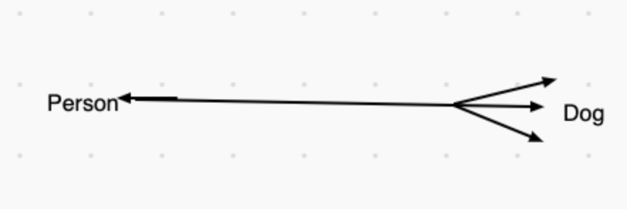

_In this series, I will go over the principles and foundations of object-oriented programming and some principles on databases. I will be using Ruby because I feel comfortable in the language; however, these concepts with some minor changes in syntax can be translated to other object-oriented programming languages, like Java, Node.js, etc._

Hello again!

If you're in New York, I hope you're staying warm and productive especially with all of this snow.

This blog post is all about relationships and associations and I swear I didn't plan for it to be published during this time. However, I supposed it fits well in the season.

This is also the part of the series where you should be thinking about whether or not you want to use a relational database, like PostgreSQL, or non-relational database, like NoSQL. Non-relational databases don't need associations between objects because you're running queries against the database.

Let's get started!

# OOP and Relational Databases

If you have been following along with your codebase, this will blog post and the next one will be very interesting for you.

When you think about relationships and/or associations objects, it's very much modeled on the real-world. For instance, if we take our `Person` and `Dog` classes from past blog posts, we can create a relationship between the two.

Let's first add our classes here.

`Person.rb`

```ruby
class Person

    @@all = []

    attr_accessor :name, :age, :height

    def initialize(name, age, height)
        @name = name
        @age = age
        @height = height #* height in inches
        @@all << self
    end

    def self.all
        @@all
    end

    def say_name
        puts "My name is #{self.name}."
    end

    def say_age
        puts "I'm #{self.age} years old."
    end

    def say_height
        puts "I'm about #{self.height} inches tall."
    end

end

alex = Person.new("alex", 26, 68)
```

`Dog.rb`

```ruby
class Dog

    attr_accessor :name
    attr_reader :breed, :age

    @@all = []

    def initialize(name, age, breed)
        @name = name
        @age = age
        @breed = breed
        @@all << self
    end

    def speak
        puts "Bark! I'm a #{self.breed}"
    end

end

dog1 = Dog.new("Rover", 3, "Poodle")
```

As it stands right now, we have a person and a dog but there's no relationship between them. We can say that a **_person_** can **_have many_** **_dogs_**, but a **_dog_** **_has one person_** (owner).



Above, you can see an illustration of a person that can have many dogs, but a dog currently only has one person or owner.


## Single Source of Truth (SSOT)

One of the most common practices in information systems design and theory is the concept of Single Source of Truth (SSOT). It simply means that the information in our database is accurate and correct. In the case of our `Person` and `Dog` classes with their _has-many relationship_, a dog can't be claimed by more than one person and have more than one owner.

## Attributes

We need to update our `Dog` class' attributes to include an owner attribute now. We'll list it with the `attr_accessor` method because a dog can have no owner and then be adopted. Let's take a look at our updated `Dog` class:

```ruby
class Dog

    attr_accessor :name, :owner
    attr_reader :breed, :age

    @@all = []

    def initialize(name, age, breed, owner)
        @name = name
        @age = age
        @breed = breed
        @owner = owner
        @@all << self
    end

    def speak
        puts "Bark! I'm a #{self.breed}"
    end

end

dog1 = Dog.new("Rover", 3, "Poodle", "No Owner (Yet)")
```

We added our `owner` attribute to the `Dog` class.

We're going to update our `Person` class slightly.

```ruby
require 'pry'

class Person

    @@all = []

    attr_accessor :name, :age, :height

    def initialize(name, age, height)
        @name = name
        @age = age
        @height = height #* height in inches
        @@all << self
    end

    def self.all
        @@all
    end

    def say_name
        puts "My name is #{self.name}."
    end

    def say_age
        puts "I'm #{self.age} years old."
    end

    def say_height
        puts "I'm about #{self.height} inches tall."
    end

    def adopt_a_dog(dog_instance)
        dog_instance.owner = self
    end

    def buy_a_dog(name, age, breed)
        # (name, age, breed, owner) #! the values for the Dog class initialize method
        Dog.new(name, age, breed, self)
    end

end

alex = Person.new("alex", 26, 68)
```

We created two new instance methods, `adopt_a_dog` and `buy_a_dog`. (Remember, an instance method doesn't use the keyword _self_ in the name, unless it's going to be a class method.) Our instance method `adopt_a_dog` takes in an argument of `dog_instance` and sets the owner attribute of that instance of `Dog` equal to the _self_ (the instance of `Person`). Sadly, our `dog1` instance, Rover, doesn't have an owner yet.

**Helpful Tip —** Create a file called `console.rb` (the name isn't important) and use `require_relative` to import your models so you can have them interact with each other easily.

`console.rb`

```ruby
require 'pry'
require_relative './app/models/dog.rb'
require_relative './app/models/person.rb'

alex = Person.new("alex", 26, 68)

dog1 = Dog.new("Rover", 3, "Poodle", "No Owner (Yet)")
```

We can adopt `dog1` when we invoke the `adopt_a_dog` method that `alex` has access to.

```ruby
alex.adopt_a_dog(dog1)

#=> #<Person:0x00007fbe93463968 @age=26, @height=68, @name="alex">
dog1
#=> #<Dog:0x00007fbe934638c8 @age=3, @breed="Poodle", @name="Rover", @owner=#<Person:0x00007fbe93463968 @age=26, @height=68, @name="alex"
```

As you can see, when we call `dog1` a second time, the `owner` attribute is no longer equal to "No Owner (Yet)." It's equal to `alex`.

We want to set the `owner` attribute an object instead of a name because this is part of having an application with a Single Source of Truth. Multiple people can be named "Alex", but they're obviously not the same person and can't/shouldn't be so interchangeable. If for any reason we needed access to the name of `dog1`'s owner, we would method chain, like so: `[dog1.owner.name](http://dog1.owner.name)` and it would return `"alex"`.

# Conclusion

This is a simple way to construct a relationship between two models. There are other ways, like `has-one` and `has_many_through`. Next week's post will involve creating a `many-to-many` relationship.
