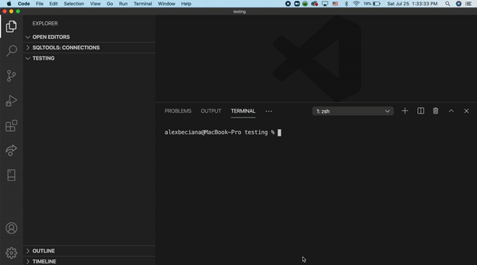

<h1>rcli_app, A Ruby Gem for Beginners</h1>

This blog post is for any beginner Rubyists who are learning on their own or attending a bootcamp that teaches Ruby.

When I was attending Flatiron School, my cohort mates and I struggled with how to get our command-line applications started during Mod 1. This was our first project week and we were in this sink-or-swim environment and at the time, a CLI application was the hardest thing we had to get through.

Although I failed my first attempt at Mod 1, it helped me grow and learn how to learn again. This second time going through Mod 1 was a real blessing in disguise because it built up my confidence in my Ruby skills and set me up for success for the following four modules. However, this time around, I was ready for Mod 1 Project Week. This time I could use my confidence and understanding to help my cohort mates but I wanted my impact to help others reach beyond my cohort and even beyond Flatiron. So I created my first RubyGem.

There is a lot of reliable documentation out there to anyone who would like to create their own RubyGem but it was a learning curve. It was something that, as a beginner Rubyist, I was not comfortable with. At that time, I could not even fathom using Ruby on Rails or build any of the projects that I worked during my time in the program.

Enter **rcli_app**

As this article has been leading up to it, my gem focuses on helping beginner Rubyists get started with creating their own command-line applications. You can check out additional documentation [here](https://github.com/abeciana1/rcli_app) and the official RubyGem page is [here](https://rubygems.org/gems/rcli_app).

There are only three steps that you need to follow (also shown in the video above):

1. Install the gem: `gem install rcli_app`
2. Run the following command, it will unpack the folder structure for the command-line application: `gem unpack rcli_app`
3. Finally, make sure to review and then install the gem in the Gemfile with `bundle install`

If you have any feedback and/or would like to ask me questions feel free to reach out!

### If you want to create your own RubyGem, check out these guides

[https://bundler.io/guides/creating_gem.html](https://bundler.io/guides/creating_gem.html)

[https://guides.rubygems.org/make-your-own-gem/](https://guides.rubygems.org/make-your-own-gem/)
